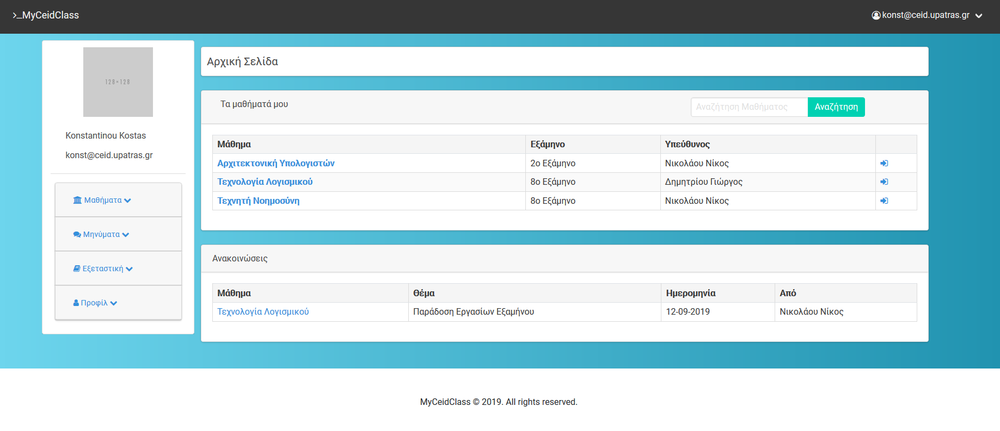

# MyCeidClass v1.0
Final project made for the Software Engineering class 2018-2019 using Laravel Framework and PHP. A RESTful  Course Management System, used to store and present educational materials , organize courses , inform students etc. If you import the database dump , you could login in using username:"konst@ceid.upatras.gr" and password:"kodikos".

